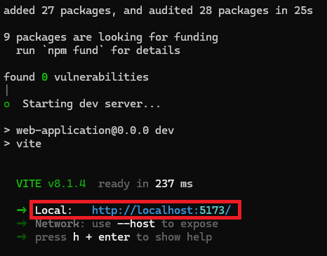
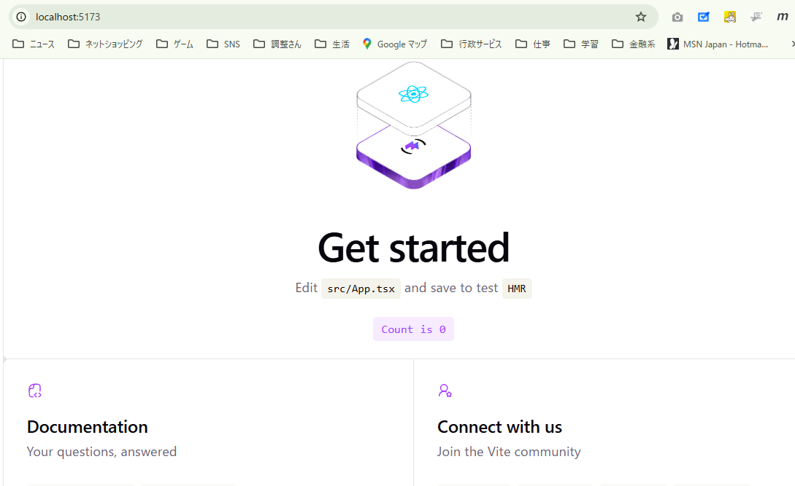

# Web画面の作成

## 概要
TypeScriptを用いてWeb画面を作成する。  
これは自分のローカルPC内でプログラムを作成し、Supabaseにアップロードする形となる。  

## ライブラリなど
+ ライブラリ：React
    + Web画面を部品単位で作るためのライブラリです。
    + ロ位グインフォーム、投稿一覧、投稿フォームなどを別々の部品として作るためにしようします。
+ 開発環境：Vite
    + ReactとTypeScriptのプロジェクトを簡単に作成・実行するためのツール
+ Supabase接続：supabase-js
    + ReactからSupabaseへ接続する公式JavaScriptライブラリ

## 作業
1. Node.jsが入っているか確認
2. React＋TypeScriptのひな型を作成
3. 必要な部品をインストール
4. 開発用Webサーバーを起動
5. ブラウザに初期画面を表示

```
http://localhost:5173/
```

## 開発サーバ起動
以下のコマンドを実行する  
```
cd C:\work\GitHub\FreezedChara\WEB_APPLICATION
npm run dev
```

下記画像のような表示がされる  
  

表示されているURL(この場合は```http://localhost:5173/```)をWebブラウザで開くと以下のようになる  
  

## 開発サーバ停止
開発サーバを起動した際のターミナルから```「Ctrl + c」```を押下して終了する  

## 各画面の編集
前提として以下のルールで作成されているようです。  
+ tsxファイル：TypeScript + JSX
    + JSX：JavaScript XMLの略
        + 要するところHTMLとJavascriptが一体になったような記法？

### メインページ
```
C:\work\GitHub\FreezedChara\WEB_APPLICATION\src\App.tsx
```

## その他雑記
```
第1段階
React画面をPCで表示する

まずはブラウザに、

冬眠キャラ投稿サイト

と表示するだけです。

第2段階
Supabaseへ接続する

SupabaseのURLと公開用キーを設定します。

第3段階
ログインできるようにする

すでに作ったAuthユーザーでログインします。

第4段階
profilesからユーザー名を取得する

画面に、

ログイン中：ロット＠管理人

と表示します。

第5段階
投稿一覧を表示する

最初はファイルなしで、コメントだけ表示できれば十分です。

第6段階
ファイルアップロードを追加する

最後にStorageと投稿登録を組み合わせます。

なぜReact＋TypeScriptを選ぶのか

今回のアプリには、次の状態管理があります。

ログインしているか
誰がログインしているか
投稿一覧
投稿中か
ファイル選択状態
エラー表示
編集中の投稿

HTMLとJavaScriptだけでも作れますが、機能が増えると整理が難しくなります。

Reactなら、画面を部品に分けられます。

TypeScriptなら、Supabaseから受け取るデータの型を明確にできます。

また、JavaやC#を扱っているご経験から考えると、型のないJavaScriptだけよりTypeScriptの方が馴染みやすいはずです。

全体像
ご自身のPC
└─ React＋TypeScript
    ├─ ログイン画面
    ├─ 投稿画面
    └─ 一覧画面
          ↓
      supabase-js
          ↓
Supabase
├─ Auth
├─ profiles
├─ freezed_chara
└─ freezed-chara-files

つまり、これからPC内で作るのは、Supabaseに保存されたデータや認証機能を利用するためのWebアプリ本体です。

次の作業は、PC上にReact＋TypeScriptの空のプロジェクトを作成し、ブラウザで初期画面を表示するところから始めます。
```
